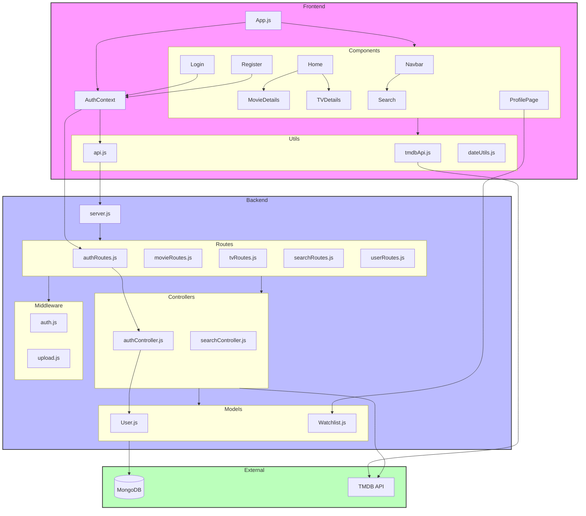

```mermaid
graph TB
    subgraph Frontend
        App[App.js]
        AuthContext[AuthContext]
        
        subgraph Components
            Navbar
            Home
            MovieDetails
            TVDetails
            Search
            Login
            Register
            ProfilePage
        end
        
        subgraph Utils
            tmdbApi[tmdbApi.js]
            api[api.js]
            dateUtils[dateUtils.js]
        end
    end

    subgraph Backend
        Server[server.js]
        
        subgraph Routes
            AuthRoutes[authRoutes.js]
            MovieRoutes[movieRoutes.js]
            TVRoutes[tvRoutes.js]
            SearchRoutes[searchRoutes.js]
            UserRoutes[userRoutes.js]
        end
        
        subgraph Controllers
            AuthController[authController.js]
            SearchController[searchController.js]
        end
        
        subgraph Models
            UserModel[User.js]
            WatchlistModel[Watchlist.js]
        end
        
        subgraph Middleware
            Auth[auth.js]
            Upload[upload.js]
        end
    end

    subgraph External
        MongoDB[(MongoDB)]
        TMDBAPI[TMDB API]
    end

    %% Frontend Component Relationships
    App --> AuthContext
    App --> Components
    Components --> Utils
    AuthContext --> api
    
    %% Backend Component Relationships
    Server --> Routes
    Routes --> Controllers
    Controllers --> Models
    Routes --> Middleware
    
    %% External Service Connections
    Models --> MongoDB
    Controllers --> TMDBAPI
    tmdbApi --> TMDBAPI
    
    %% Frontend-Backend Communication
    api --> Server
    
    %% Component Details
    Home --> MovieDetails
    Home --> TVDetails
    Navbar --> Search
    ProfilePage --> WatchlistModel
    
    %% Auth Flow
    Login --> AuthContext
    Register --> AuthContext
    AuthContext --> AuthRoutes
    AuthRoutes --> AuthController
    AuthController --> UserModel

    style Frontend fill:#f9f,stroke:#333,stroke-width:2px
    style Backend fill:#bbf,stroke:#333,stroke-width:2px
    style External fill:#bfb,stroke:#333,stroke-width:2px
```
